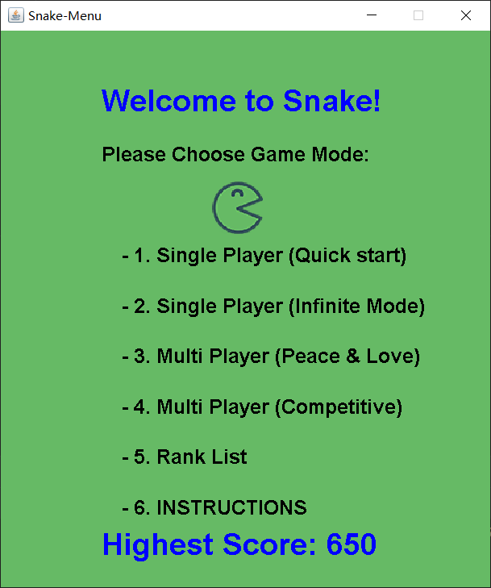
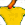
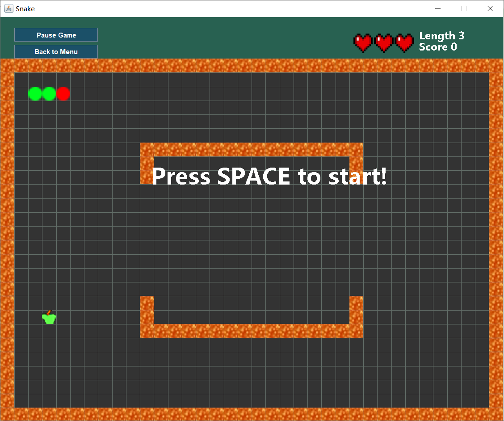
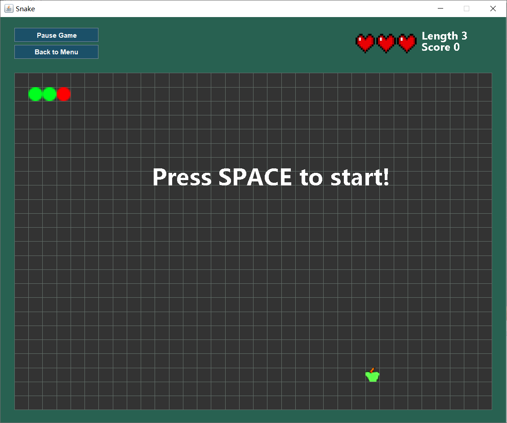
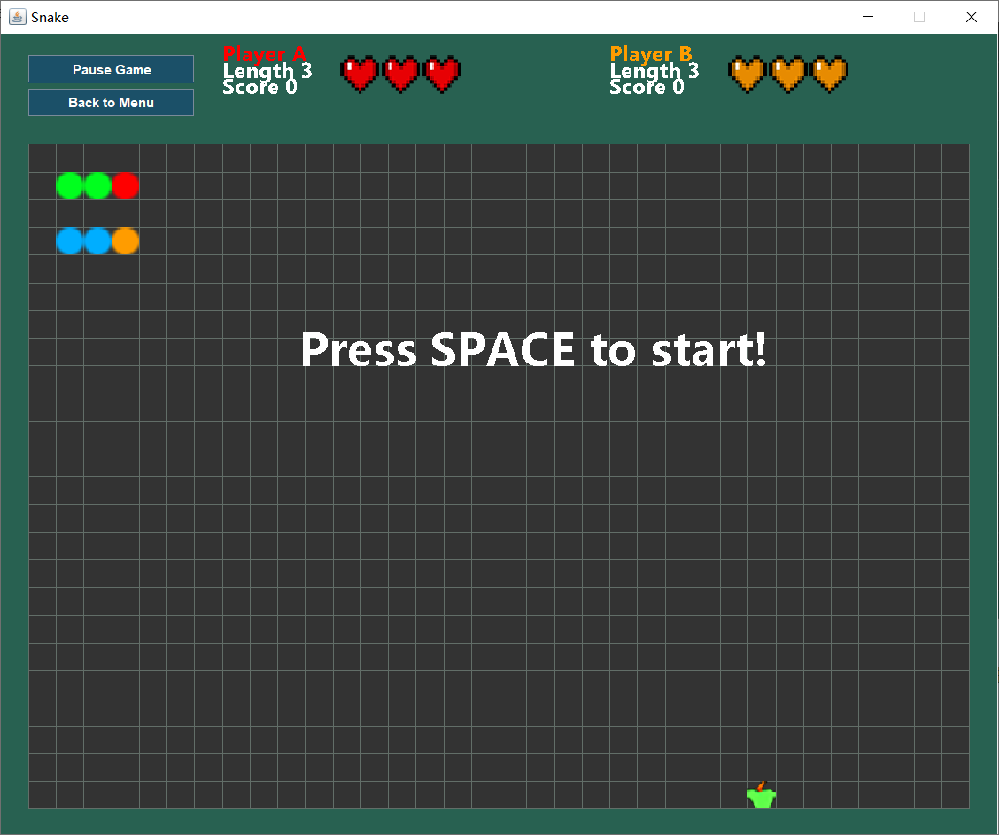
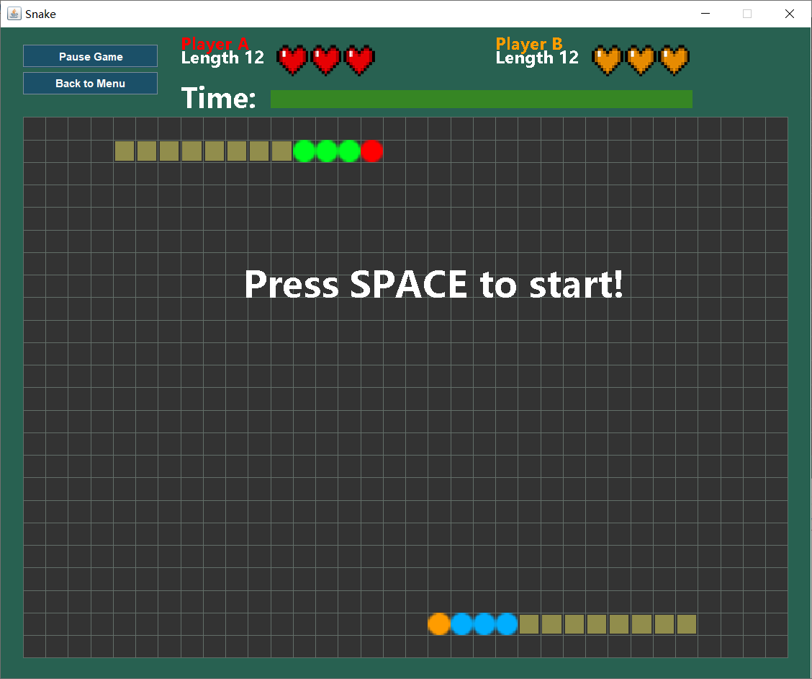
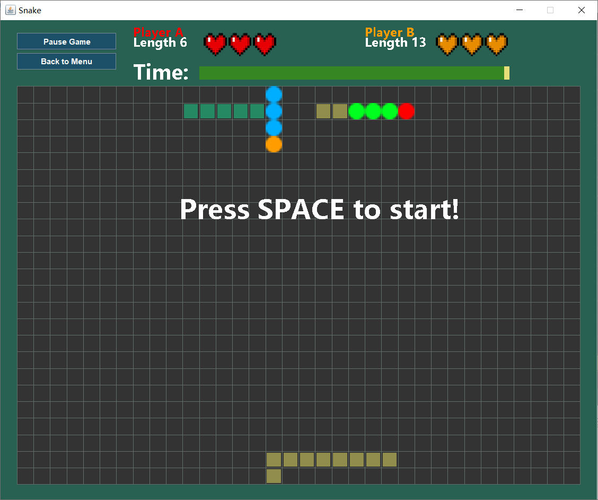

# Welcome to the Snake!

This is the introduction of the Snake game.

1. Menu page:

    

As you can see, this Snake game includes two single player modes and two multiplayer modes.

<ul>
    <li>Single Player (Quick start)</li>
    <li>Single Player (Infinite Mode)</li>
    <li>Multi Player (Peace & Love)</li>
    <li>Multi Player (Competitive)</li>
</ul>
Basic operation instructions:

1. In the menu interface, simply press the corresponding number key to enter the corresponding game mode.

2. In all single player modes, players need to control the snake's movement direction through the "↑", "↓", "←", "→" keys on the keyboard.

3. In all multiplayer modes, player one needs to control the snake's movement direction through the "↑", "↓", "←", "→" keys on the keyboard, 
while player two needs to control the snake's movement direction through the "W", "S", "A", "D" keys on the keyboard.

4. In all modes, each player has three lives. When the snake head touches the body of the snake, one life will be lost.

5. In Single Player (Quick start), Single Player (Infinite Mode), and Multi Player (Peace & Love), the longer the player's length, the faster the movement speed. However, the movement speed will not always increase. When the player's length reaches a certain value, the player's movement speed will not change.

6. In all modes, there is a chance that a special apple will appear after the player eats an apple.

   There are two types of special apples:

   1. Golden Apple:

      

      Eating a golden apple will reduce the length of the snake by 3, while also giving the 
      player 50 points. Therefore, whether the player can eat the golden apple is often the key to breaking the record or achieving victory.

   2.  Purple apple:

      

   Eating a purple apple will randomly trigger one of the following three effects:

      - After eating a purple apple, the snake controlled by the player will enter a poisoned state after 5 seconds. In the poisoned state, all turning operations carried out by the player will be opposite to what they would normally be (for example, pressing the "up" arrow key will cause the snake to turn downwards instead).
      - The speed of the player's snake will be set to a faster speed.
      - The player's score will be increased by 70.

  7. In Multi Player (Competitive) mode, there will be no apples generated.

  8. In the Rank List, you will see the top 10 scores achieved in Single Player (Infinite Mode).

Next, I will introduce these four different modes one by one:

 1.   Single Player (Quick start)

   

In this mode, the game field is filled with magma. Be careful! Snakes cannot swim in magma. So when your snake touches the magma, you will lose the game. At the same time, when the length of the player's snake reaches 20, you win.

2.    Single Player (Infinite Mode)

As you can see, there is no magma in this mode, so you can move around boldly. There are no boundaries in this mode. For example, if the snake's head goes out of the game screen in one direction, it will enter from the opposite direction. So please enjoy the Snake game to the fullest. The scores generated in this mode will be ranked and displayed on the Rank List page. Strive for higher scores!

3. Multi Player (Peace & Love)

This is the Two Player mode. In this mode, there is no countdown, and collisions between player A and player B will not result in anything. Each player only needs to eat apples. When one player's life value reaches zero, the game will end. After the game ends, the player with the higher final score wins. However, each heart is worth 25 points. So try to avoid getting hurt as much as possible.

4. Multi Player (Competitive)

This is a special Two Player mode. In this mode, there are no boundaries and no apples generated. Players need to achieve their goals by snatching the backpack behind the other player's snake. If player A's snake head touches player B's backpack, the backpack behind snake B will also fall off. See the figure below for reference:

After that, picking up the backpacks that have fallen to the ground will increase the length of the player's snake. After the countdown ends, the player with the longer snake length will win.

It is worth mentioning that if player A's snake head touches player B's body (circular part), player A will lose one heart. Therefore, in this mode, you cannot recklessly rush around.

